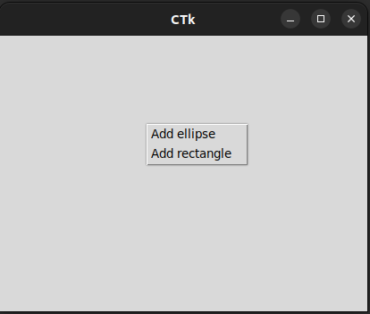
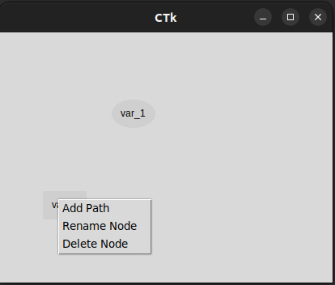
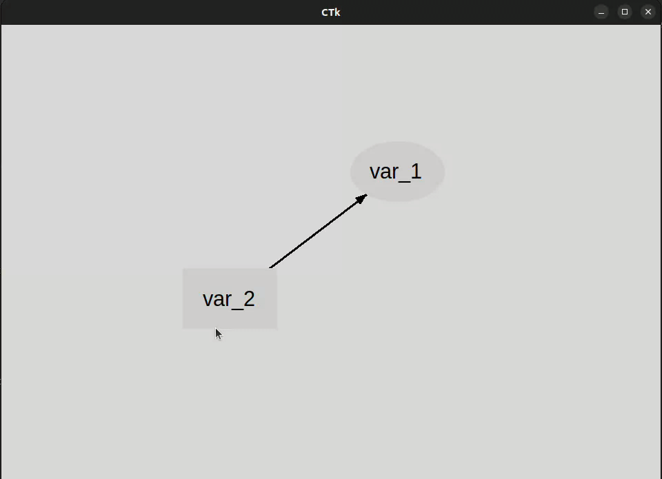

# edno - **Ed**ges and **No**des using tkinter

Edno is a tkinter widget for basic directed graphs. The objective is to provide a simple to integrate framework for defining path models, such as linear regressions, path analysis, and structural equation models. Edno builds on tkinter's Canvas as well as customtkinter.

## Example

To define a minimal application with edno, first install the package. Edno can then be added to a CTk root as follows:

```{python}
import customtkinter as ctk
import edno

ctk.set_appearance_mode("Light")
ctk.set_default_color_theme(
    "blue"
)

root = ctk.CTk()
root.geometry("1000x850")
root.grid_columnconfigure(0, weight=1)
root.grid_rowconfigure(0, weight=1)
dag = edno.EdnoCanvas(root)
dag.grid(row=0, column=0, sticky="nsew")
root.mainloop()
```
Note that the main screen will be empty. Right-clicking allows adding nodes:



Right clicking on nodes allows adding paths:



Nodes can be moved around and the canvas supports rudimentary zooming:



Finally, there is a limited implementation of snapping: When nodes are horizontally or vertically closely aligned, they snap into perfect alignment.